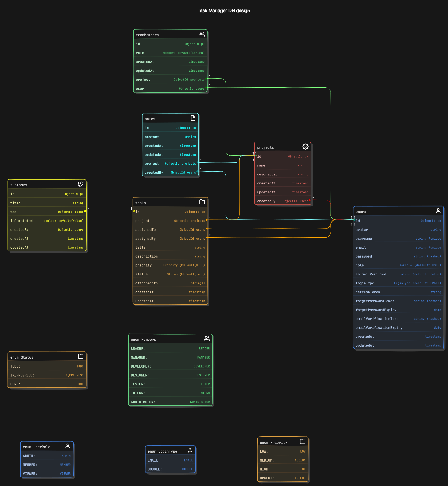

# 📝 Trackist

**Trackist** is a minimal and modern web app to help you stay consistent, organized, and intentional with your time. Whether you're tracking tasks, daily habits, or personal goals, Trackist keeps everything in one beautiful, distraction-free space.

---

## ✨ Features


- Organized File and Folder Structure

- Fully Responsive Design

- Well-organized & intuitive UI

- Server Side State Management & Caching using React Query.

- Client Side States Management with Recoil

- Custom Hooks

- Schema Validation using zod.

- Robus Authentication

- Google SSO (Single Sign-On)

- Security Measures like rate limiting and referesh tokens.

- Documentation with local development setup guide.

- Dark and Light Mode

## 🛠️ Tech Stack

- [MongoDB](https://www.mongodb.com/) – database

- [Express](https://expressjs.com/) – framework

- [React](https://react.dev/) – frontend

- [Node.js](https://nodejs.org/) – JavaScript runtime

- [Tailwind CSS](https://tailwindcss.com/) – CSS

- [Redux](https://recoiljs.org/) – state management

- [Tanstack Query](https://tanstack.com/query/latest) – asynchronous state management

- [Mongoose](https://mongoosejs.com/) – ODM

- [Git](https://git-scm.com/) – versioning

- [Docker](https://www.docker.com/) – containerziation

- [Vite](https://vitejs.dev/) – building

- [Vercel](https://vercel.com/) – deployments

## 🏁 Installation

##  Models

Schema: [eraserSchema.txt](./backend/eraserSchema.txt)




## <a name="docker-setup"> 🐳&nbsp;&nbsp; Quick Start with Docker</a>

0. **Prerequisites**

   Make sure you have the [Docker](https://www.docker.com/) installed on your machine.

1. **Clone the repository:**

   ```bash
   git clone https://github.com/ravirajbhardwaj/trackist.git
   ```

2. **Navigate to the project directory:**

   ```bash
   cd trackist
   ```

3. **Add Environment Variables:**

   Create `.env` files in the server and client folder and copy paste the content of `.env.sample`

   ```bash
   # server side
   cd backend
   cp .env.sample .env # then update `.env` with your creadentials.
   cd ..

   # client side
   cd frontend
   cp .env.smaple .env # then update `.env` if required.
   cd ..
   ```

4. **Start all services using Docker Compose:**

   ```bash
   docker-compose up --watch

   # --watch to Enable Watch (For Live Update aka Hot Reloading)
   ```

<br>

## <a name="manual-setup"> 🖥️&nbsp;&nbsp; Manual Setup</a>

0.  **Prerequisites** <br>
    Make sure you have the following installed on your machine:

    - [Git](https://git-scm.com/)
    - [Node.js](https://nodejs.org/en)
    - [npm](https://www.npmjs.com/) (Node Package Manager)

1.  **Clone the repository:**

    ```bash
    git clone https://github.com/ravirajbhardwaj/trackist.git
    ```

2.  **Navigate to the project directory:**

    ```bash
    cd trackist
    ```

3.  **Setup Backend:**

    - **Navigate to the Backend Codebase:**

      ```bash
      cd backend/
      ```

    - **Install dependencies:**

      ```bash
      npm install
      ```

    - **Add Environment Variables:**

      Create `.env` file in the root folder and copy paste the content of `.env.sample`

      ```bash
      cp .env.sample .env
      ```

      Update credentials in `.env` with your creadentials.

    - **Start the Server:**

      ```bash
      npm start
      ```

    - **Explore the API:**

      Access the project APIs at the specified endpoints using [API Docs]().

4.  **Setup Frontend:**

    - **Navigate to the Frontent Codebase:**

      ```bash
      cd frontend/
      ```

    - **Install dependencies:**

      ```bash
      npm install
      ```

    - **Add Environment Variables:**

      Create `.env` file in the root folder and copy paste the content of `.env.sample`

      ```bash
      cp .env.sample .env
      ```

      If required, update necessary credentials.

    - **Start the frontend app:**

      ```bash
      npm run dev
      ```

    - **Start the backend server:**

      ```bash
      cd ../backend
      npm start
      ```

    - **Open app in browser:**

      Visit [https://localhost:5173](https://localhost:5173) to access frontent.

<br>

<br>

## 🤝&nbsp;&nbsp;Contributing

Contributions are always welcome!

See [CONTRIBUTING.md](./CONTRIBUTING.md) for ways to get started.
</br></br>
