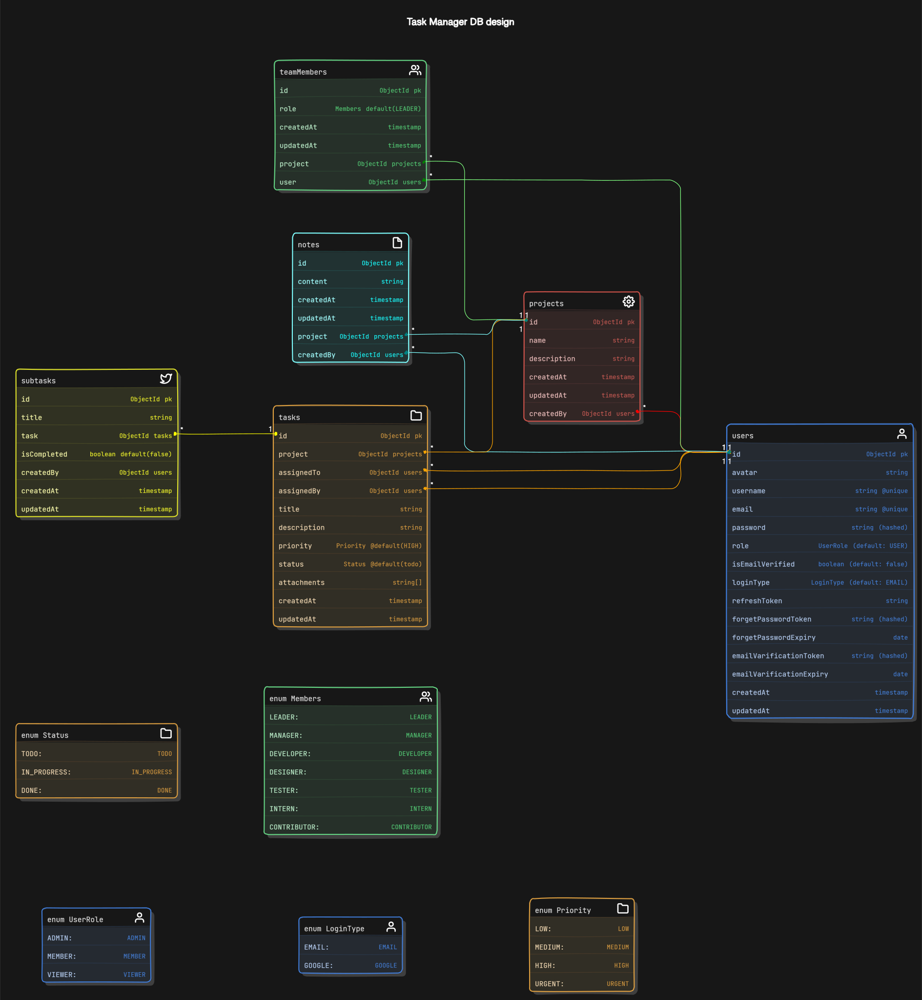

<h1 align="center">Trackist 📝</h1>

<div align="center">

[](https://x.com/eravitw) &nbsp;
[](mailto:ravirajbhardwaaj@gmail.com) &nbsp;
[](https://conventionalcommits.org) &nbsp;
[](./LICENSE)

[](https://bun.sh/)
[](https://hono.dev/)
[](https://expressjs.com/)
[](https://www.postgresql.org/)
[](https://neon.tech/)
[](https://www.prisma.io/)
[](https://resend.com/)
[](https://jwt.io/)
[](https://zod.dev/)
[](https://getpino.io/)

</div>
Trackist is a simple, efficient task management tool built to help individuals and small teams organize, track, and complete tasks with ease.

<br/>


[eraserSchema.txt](./backend/eraserSchema.txt)

### Install dependencies

0. **Prerequisites**

Make sure you have the following installed on your machine:

- [Git](https://git-scm.com/)
- [Node.js](https://nodejs.org/en)
- [npm](https://www.npmjs.com/) (Node Package Manager)

1. **Clone the repository:**

```bash
  git clone https://github.com/ravirajbhardwaj/trackist.git
```

2. **Navigate to the project directory:**

```bash
cd trackist
pnpm install
```

### 3. Set up environment variables

Create `.env` files in the server and client folder and copy paste the content of `.env.sample`

```bash
# server side
cd backend
cp .env.eample .env # then update `.env` with your creadentials.
cd ..

# client side
cd frontend
cp .env.emaple .env # then update `.env` if required.
cd ..
```

### 3. Set up environment variables

This project requires setting up environment variables and generating key pairs for authentication.

1. Create a `.env` file in the root directory by copying the `.env.example` file:

```bash
cp .env.example .env
```

2. Create a `secrets` directory at the root of the project:

```bash
mkdir secrets
```

---

3. Inside the `secrets` directory, create two files:

- `private.pem`: This will store the private key.
- `public.pem`: This will store the public key.

4. Generate a public and private key pair. You can use the following command to generate them:
   ✅ 1. Generate Private Key (private.pem)

   ```bash
   openssl genpkey -algorithm RSA -out private.pem -pkeyopt rsa_keygen_bits:2048
   ```

   - -algorithm RSA → We are using RSA algorithm.
   - rsa_keygen_bits:2048 → Sets key size to 2048 bits (standard secure size).
   - This generates `private.pem`.
   - The private key is used to sign the JWTs, ensuring that only the server can create valid tokens.
   - The private key should be kept secret and secure, as it is used to sign the JWTs.

   ✅ 2. Extract Public Key (public.pem) from Private Key

   ```bash
   openssl rsa -pubout -in private.pem -out public.pem
   ```

   - -pubout → Extracts the public key from the private key.
   - -in private.pem → Specifies the input file (private key).
   - -out public.pem → Specifies the output file (public key).
   - This generates `public.pem`.
   - The public key is derived from the private key, allowing you to share it without compromising security.
   - The private key should be kept secret and secure, while the public key can be shared with anyone who needs to verify the JWTs signed with the private key.
   - The public key is used to verify the JWTs, ensuring that they were signed by the server and have not been tampered with.

---

5. Use the following commands to run the project:

   Development mode

   ```bash
   pnpm run dev
   ```

   Production mode

   ```bash
   pnpm start
   ```

---

## 🔐 Robust Authentication System

A modern authentication system with features like secure password handling, email support, file uploads, and middleware-protected routes.

---

## 📚 Additional Documentation

### [Authentication Guide](docs/auth.md)

Detailed documentation on how the authentication system works, including middleware usage, token management, and error handling.

### [Learning Resources](docs/learning.md)

A curated list of resources to help you understand the technologies used in this project, such as Node.js, Express, MongoDB, and JWT.

---

## 📦 Postman Collection

📥 Use the Postman collection below to test all the available APIs:

[](https://god.gw.postman.com/run-collection/43014457-eeff1890-8ee8-4276-ad6c-4dd40176c874?action=collection%2Ffork&source=rip_markdown&collection-url=entityId%3D43014457-eeff1890-8ee8-4276-ad6c-4dd40176c874%26entityType%3Dcollection%26workspaceId%3D6dea7e89-0c3d-4835-8a6f-f905b8b26190)

Import the collection into Postman and set the environment variables like `server_url`, etc.

---

## ✨ Author & License [](LICENSE)

[Ravi Raj Bhardwaj](http://x.com/ravirajbhrdwaj)

Built with ❤️ to simplify auth flows and speed up backend development.
