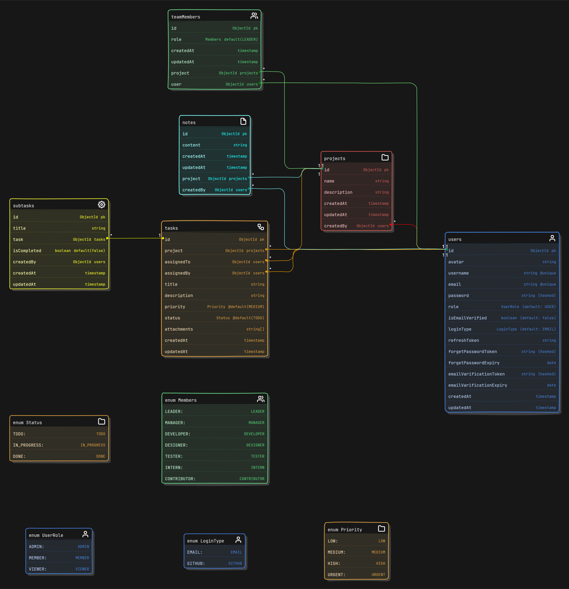

# 📝 Trackist

**Trackist** is a simple, efficient task management tool built to help individuals and small teams organize, track, and complete tasks with ease.

---

## ✨ Features

- Organized File and Folder Structure

- Fully Responsive Design

- Well-organized & intuitive UI

- Server Side State Management & Caching using React Query.

- Client Side States Management with Redux.

- Custom Hooks

- Schema Validation using Express validator.

- Robus Authentication

- Google SSO (Single Sign-On)

- Security Measures like rate limiting and referesh tokens.

- Documentation with local development setup guide.

- Dark and Light Mode

## 🛠️ Tech Stack

- [MongoDB](https://www.mongodb.com/) – database

- [Express](https://expressjs.com/) – framework

- [React](https://react.dev/) – frontend

- [Node.js](https://nodejs.org/) – JavaScript runtime

- [Tailwind CSS](https://tailwindcss.com/) – CSS

- [Zustand](https://zustand-demo.pmnd.rs/) – state management

- [Mongoose](https://mongoosejs.com/) – ODM

- [Git](https://git-scm.com/) – versioning

- [Docker](https://www.docker.com/) – containerziation

- [Vite](https://vitejs.dev/) – building

- [Vercel](https://vercel.com/) – deployments

## 🏁 Installation

## Models

Schema: [eraserSchema.txt](./backend/eraserSchema.txt)



### 2. Install dependencies

0. **Prerequisites**

Make sure you have the following installed on your machine:

- [Git](https://git-scm.com/)
- [Node.js](https://nodejs.org/en)
- [npm](https://www.npmjs.com/) (Node Package Manager)

1. **Clone the repository:**

```bash
  git clone https://github.com/ravirajbhardwaj/trackist.git
```

2. **Navigate to the project directory:**

```bash
cd trackist
npm install
```

### 3. Set up environment variables

Create `.env` files in the server and client folder and copy paste the content of `.env.sample`

```bash
# server side
cd backend
cp .env.eample .env # then update `.env` with your creadentials.
cd ..

# client side
cd frontend
cp .env.emaple .env # then update `.env` if required.
cd ..
```

---

This project requires setting up environment variables and generating key pairs for authentication.

1. Create a `secrets` directory at the root of the project:

```bash
mkdir secrets
```

---

2. Inside the `secrets` directory, create two files:

- `private.pem`: This will store the private key.
- `public.pem`: This will store the public key.

3. Generate a public and private key pair. You can use the following command to generate them:

✅ 1. Generate Private Key (private.pem)

```bash
openssl genpkey -algorithm RSA -out private.pem -pkeyopt rsa_keygen_bits:2048
```

- -algorithm RSA → We are using RSA algorithm.
- rsa_keygen_bits:2048 → Sets key size to 2048 bits (standard secure size).
- This generates `private.pem`.
- The private key is used to sign the JWTs, ensuring that only the server can create valid tokens.
- The private key should be kept secret and secure, as it is used to sign the JWTs.

✅ 2. Extract Public Key (public.pem) from Private Key

```bash
openssl rsa -pubout -in private.pem -out public.pem
```

- -pubout → Extracts the public key from the private key.
- -in private.pem → Specifies the input file (private key).
- -out public.pem → Specifies the output file (public key).
- This generates `public.pem`.
- The public key is derived from the private key, allowing you to share it without compromising security.
- The private key should be kept secret and secure, while the public key can be shared with anyone who needs to verify the JWTs signed with the private key.
- The public key is used to verify the JWTs, ensuring that they were signed by the server and have not been tampered with.

---

### 4. This section provides instructions to start the database container using Docker Compose.

Prerequisites:

- Ensure Docker and Docker Compose are installed on your system..

Steps to start the database container:

1. Open a terminal or command prompt.
2. Navigate to the directory containing the `compose.yml` file.
3. Run the following command to start the database container in detached mode:

```bash
docker-compose up -d
```

4. Confirm that the container is running by executing:

```bash
docker ps
```

5. To stop the container, use:

```bash
docker-compose down
```

---

#### 5. Use the following commands to run the project:

- **Start the frontend app:**

  ```bash
  cd frontend
  npm install
  npm run dev
  ```

- **Start the backend server:**

  ```bash
  cd ../backend

  npm start
  ```

- **Open app in browser:**

Visit [https://localhost:5173](https://localhost:5173) to access frontent.

- **Explore the API:**

  Access the project APIs at the specified endpoints using [API Docs]().

---

## 🤝&nbsp;&nbsp;Contributing

Contributions are always welcome!

See [CONTRIBUTING.md](./CONTRIBUTING.md) for ways to get started.
</br></br>
